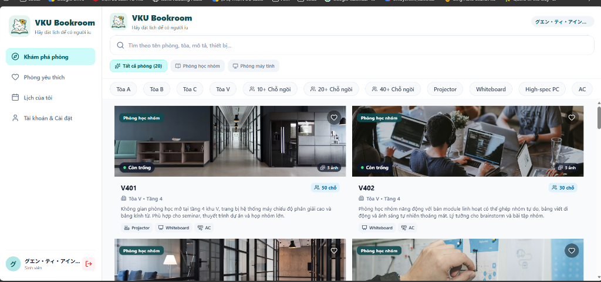
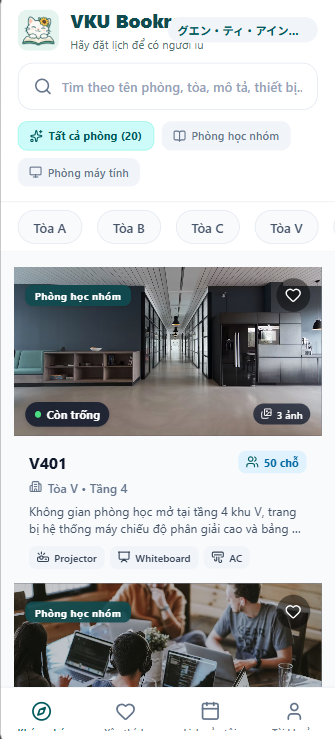
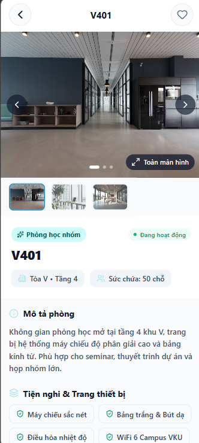
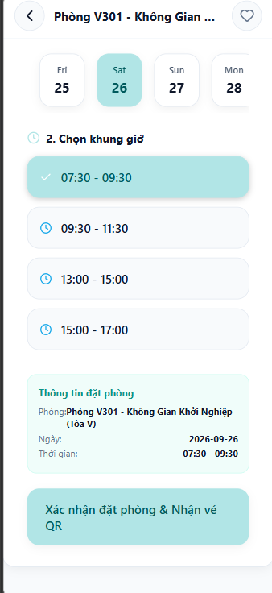
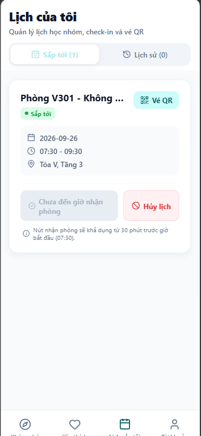

# MINI-PROJECT SHORT TECHNICAL REPORT

**Học phần:** Phát triển ứng dụng di động đa nền tảng (9) · Trường Đại học CNTT & Truyền thông Việt - Hàn (VKU)

---

### THÔNG TIN HỌC PHẦN & SINH VIÊN

- **HỌC PHẦN & ĐỀ TÀI:** Mini-Project 2: VKU Bookroom
- **SINH VIÊN THỰC HIỆN:** Nguyễn Thị Ánh Vy — **23IT323**
- **CỔNG ĐÀO TẠO:** daotao.vku.udn.vn/sv/lich-hoc#
- **NGÀY NỘP BÁO CÁO:** 25/09/2026

---

## 🔗 1. General Information & Deliverable Links

Tài nguyên dự án được công khai và kiểm thử thực tế:

- **📹 Video Demo URL:** [https://youtube.com/shorts/XyUuxwCj4HY](https://youtube.com/shorts/XyUuxwCj4HY)
- **📦 Download APK Release (Trực tiếp từ GitHub Release):** [https://github.com/anhvy0904/Room-Booking/releases/download/v1.0.0/VKU_Bookroom.apk](https://github.com/anhvy0904/Room-Booking/releases/download/v1.0.0/VKU_Bookroom.apk)
- **☁️ Link Cloud Build APK (Expo EAS Build):** [https://expo.dev/accounts/anhvy0904/projects/VKU_bookroom/builds/51804847-bb5f-4b2a-ba62-74397423d9dd](https://expo.dev/accounts/anhvy0904/projects/VKU_bookroom/builds/51804847-bb5f-4b2a-ba62-74397423d9dd)
- **🏷️ Trang phát hành GitHub Release (v1.0.0):** [https://github.com/anhvy0904/Room-Booking/releases/tag/v1.0.0](https://github.com/anhvy0904/Room-Booking/releases/tag/v1.0.0)
- **💻 GitHub Repository:** [https://github.com/anhvy0904/Room-Booking](https://github.com/anhvy0904/Room-Booking)
- **📂 Vị trí file APK khi build cục bộ (Local Build):** `android/app/build/outputs/apk/release/app-release.apk`

---

## 🎯 2. Đối chiếu Tiêu chuẩn Đánh giá (Rubric Mapping)

Dự án được xây dựng bám sát 100% các tiêu chí trong Grading Rubric bài giảng VKU để đạt mức điểm tối đa:

| Tiêu chí (Rubric) | Tỷ trọng | Yêu cầu bài giảng | Minh chứng đạt được trong VKU Bookroom |
| :--- | :---: | :--- | :--- |
| **Features** | **30%** | Tìm kiếm, bộ lọc đa điều kiện, quy trình đặt chỗ trọn vẹn. | • Tìm kiếm tiếng Việt không dấu đa trường (tên phòng, tòa, mô tả, tiện nghi).<br>• Bộ lọc kết hợp điều kiện AND (Tòa A, B, C, V; Sức chứa 6+, 10+, 20+, 30+; Tiện nghi máy chiếu, điều hòa, dàn PC, bảng trắng).<br>• Quy trình đặt chỗ khép kín: Chọn ngày trong 7 ngày tới, 4 ca học 2 giờ cố định, xem trước thông tin tóm tắt, tạo vé QR, check-in từ 30 phút trước giờ học, hủy lịch và trả phòng sớm giải phóng khóa phòng tức thì. |
| **UI / UX** | **25%** | Giao diện mượt mà, layout chuyên nghiệp, tối ưu native gesture và đa nền tảng. | • Hỗ trợ đa nền tảng 100% Responsive giữa Mobile (< 768px - Bottom Tabs) và Desktop/Tablet (>= 768px - Sidebar cố định + Lưới phòng 2-3 cột).<br>• Bộ ảnh thực tế chất lượng cao độc nhất cho từng phòng (20 phòng 20 ảnh riêng biệt).<br>• Carousel lướt ảnh mượt mà, thumbnail trực quan và trình xem ảnh toàn màn hình phóng to (Fullscreen Gallery Modal).<br>• Xử lý Safe Area Insets cho notch và dynamic island; micro-interactions nhún mềm mại. |
| **Navigation** | **15%** | React Navigation / Expo Router (Stack + Tabs) cấu trúc chuẩn, định nghĩa route types chống crash. | • Expo Router (v57) phân tầng: Root Stack với Auth Guard + Tabs Navigator 4 tab (`/`, `/favorites`, `/bookings`, `/account`) + Stack Screen `/room/[id]`, `/sign-in`.<br>• Xử lý điều hướng an toàn với `canGoBack()` chống lỗi `GO_BACK` khi truy cập trực tiếp bằng URL web hoặc F5. |
| **State Management** | **15%** | Tách biệt rõ ràng Client State (Zustand + AsyncStorage) và Server State (TanStack Query). | • **Client State (Zustand):** Quản lý phiên đăng nhập, bộ lọc, danh sách phòng yêu thích, cấu hình bật/tắt nhắc lịch; đồng bộ bền vững qua `AsyncStorage`.<br>• **Server State (TanStack Query v5):** Quản lý realtime cache từ Firebase RTDB qua custom hook `useRealtimeQuery`, tự động hủy listener khi unmount, chống memory leak và xử lý stale cache khi mất mạng. |
| **Code Quality** | **15%** | Chuẩn TypeScript strict, clean custom hooks, kiểm thử tự động. | • TypeScript Strict Mode (0 type errors).<br>• Tách các custom hooks rõ ràng: `useRealtimeQuery`, `useBookingSlots`, `useBookingActions`, `useRoomFilters`, `useAuth`, `useNow`.<br>• Bộ kiểm thử hồi quy độc lập đạt **10/10 tests passed** (`node --test tests/booking-regressions.test.cjs`).<br>• ESLint chuẩn Expo đạt **0 warnings/errors**. |

---

## ✅ 3. Feature Implementation Checklist

### Feature 1: Responsive Mobile Viewport & Adaptive Navigation `[COMPLETE]`
- **Chi tiết triển khai:** Ứng dụng tự động co giãn và chuyển đổi layout mượt mà theo kích thước màn hình:
  - **Trên Desktop (>= 768px):** Cột **Sidebar** cố định bên trái hiển thị Logo VKU Bookroom, Slogan *"Hãy đặt lịch để có người iu"*, menu điều hướng và hồ sơ sinh viên; danh sách 20 phòng hiển thị dạng lưới 2 cột. Màn hình chi tiết chia 2 cột độc lập (Ảnh/tiện nghi bên trái, Form đặt lịch bên phải).
  - **Trên Mobile (< 768px):** Tự động chuyển đổi thành thanh điều hướng **Bottom Navigation Bar** 4 tabs thân thiện với thao tác một tay. Xử lý triệt để Safe Area Insets cho thanh điều hướng và tai thỏ.

### Feature 2: Smart Search & Multi-Criteria Filtering Panel `[COMPLETE]`
- **Chi tiết triển khai:** Tích hợp thuật toán chuẩn hóa chuỗi `removeVietnameseTones` cho phép sinh viên gõ tiếng Việt không dấu (ví dụ: `phong hoc`, `may chieu`, `toa a`, `tang 2`) vẫn tìm thấy chính xác theo tên, tòa, tầng, mô tả hoặc thiết bị.
- Bộ lọc nâng cao hỗ trợ kết hợp đồng thời theo điều kiện AND: Tòa nhà (Tất cả, A, B, C, V), Sức chứa tối thiểu (Tất cả, 6+, 10+, 20+, 30+), Loại phòng (Học nhóm vs Phòng máy) và nhiều tiện nghi cùng lúc; hỗ trợ nút "Xóa lọc" nhanh.

### Feature 3: Complete Booking Engine, QR Ticket & Lifecycle Management `[COMPLETE]`
- **Chi tiết triển khai:** Quy trình đặt phòng khép kín và an toàn:
  - Chọn ngày học trong 7 ngày tới.
  - Chọn 1 trong 4 ca học 2 tiếng cố định (**07:30–09:30**, **09:30–11:30**, **13:30–15:30**, **15:30–17:30**).
  - Hiển thị hộp tóm tắt thông tin đặt phòng trước khi bấm xác nhận.
  - Sinh vé điện tử dạng mã QR chuẩn (`react-native-qrcode-svg`) kèm mã đối chiếu buổi học.
  - Hỗ trợ nút **"Nhận phòng (Check-in)"** trực tiếp trong ca học (khả dụng từ 30 phút trước giờ bắt đầu).
  - Hỗ trợ **"Hủy lịch"** trước giờ học hoặc **"Trả phòng sớm"** sau khi nhận phòng để lập tức giải phóng khóa phòng cho sinh viên khác.

### Feature 4: Distinct Photo Galleries & Fullscreen Image Viewer Modal `[COMPLETE]`
- **Chi tiết triển khai:** Mỗi phòng trong số 20 phòng đều sở hữu một bộ ảnh chụp thực tế riêng biệt (ảnh bìa + gallery). 
- Trang chi tiết phòng tích hợp carousel lướt ảnh mượt mà kèm thanh thumbnail chọn nhanh bên dưới, nút chuyển ảnh trước/sau và nút **Toàn màn hình** mở modal xem ảnh phóng to kèm chỉ số ảnh (`1/3`, `2/3`...).

### Feature 5: Client vs Server State Separation (Zustand + TanStack Query v5) `[COMPLETE]`
- **Chi tiết triển khai:**
  - **Zustand (`useBookingStore`):** Lưu trữ Client State độc lập bao gồm trạng thái bộ lọc đa tiêu chí, danh sách phòng yêu thích (`favoriteRoomIds`), tùy chọn bật/tắt nhắc lịch và phiên đăng nhập của sinh viên; đồng bộ tự động xuống `AsyncStorage`.
  - **TanStack Query v5:** Quản lý Server State, kết nối trực tiếp với Firebase Realtime Database qua custom hook `useRealtimeQuery` với cơ chế `skipToken` và fallback default query function, tự động lắng nghe thay đổi thời gian thực và giải phóng subscription khi component unmount.

### Feature 6: Automated Background Reminders & Local Notifications `[COMPLETE]`
- **Chi tiết triển khai:** Tự động lên lịch thông báo cục bộ của hệ điều hành trước buổi học **15 phút** (sử dụng thư viện `expo-notifications`). 
- Tích hợp nút **"Thử thông báo sau 5 giây"** trực tiếp trong màn hình Tài khoản giúp sinh viên kiểm tra quyền hệ thống và chứng minh tính năng thông báo hoạt động tức thì.

### Feature 7: Firebase Authentication & Security Control `[COMPLETE]`
- **Chi tiết triển khai:** Tích hợp Firebase Authentication hỗ trợ đầy đủ luồng Đăng ký & Đăng nhập bằng Email/Mật khẩu (có kiểm tra độ dài mật khẩu, xác nhận mật khẩu, thông báo lỗi tiếng Việt thân thiện) và đăng nhập bằng tài khoản Google. Hỗ trợ nút đăng xuất an toàn có hộp thoại xác nhận.

---

## 🏗️ 4. Technical Architecture & Project Structure

Dự án tuân thủ kiến trúc phân tầng sạch (Clean Architecture), tách biệt giữa UI, State, Domain Logic và API Data Services:

```text
VKU_bookroom/
├── assets/                          # Logo, icon, hình ảnh ứng dụng
│   ├── bookroom-logo.png            # Logo chính thức VKU Bookroom
│   └── favicon.png
├── docs/
│   └── screenshots/                 # Bộ ảnh chụp minh chứng thực tế
│       ├── 01-desktop.png           # Hình 1: Giao diện Desktop
│       ├── 02-mobile.png            # Hình 2: Giao diện Mobile
│       ├── 03-room-detail.png       # Hình 3: Chi tiết phòng & Gallery
│       ├── 04-booking.png           # Hình 4: Đặt phòng & Ca học
│       └── 05-booking-success.png   # Hình 5: Đặt phòng thành công (Lịch của tôi)
├── src/
│   ├── api/                         # Tầng kết nối Firebase & Auth
│   │   ├── auth.ts                  # Đăng ký, đăng nhập email, đăng xuất
│   │   ├── bookings.ts              # Đặt phòng, check-in, trả sớm, atomic lock
│   │   ├── googleAuth.ts            # Tích hợp Google Sign-In
│   │   └── rooms.ts                 # Realtime snapshot listener danh mục phòng
│   ├── app/                         # Điều hướng Expo Router (Screens)
│   │   ├── (tabs)/                  # Nhóm màn hình chính
│   │   │   ├── _layout.tsx          # Bố cục Tabs Bar & Desktop Sidebar
│   │   │   ├── index.tsx            # Màn hình Khám phá & Tìm kiếm
│   │   │   ├── favorites.tsx        # Màn hình Phòng yêu thích
│   │   │   ├── bookings.tsx         # Màn hình Lịch của tôi (Sắp tới & Lịch sử)
│   │   │   └── account.tsx          # Màn hình Tài khoản & Thử thông báo 5s
│   │   ├── room/[id].tsx            # Màn hình Chi tiết phòng, Gallery & Đặt lịch
│   │   ├── sign-in.tsx              # Màn hình Đăng nhập & Đăng ký
│   │   └── _layout.tsx              # Root Layout, Auth Guard & Providers
│   ├── components/                  # Thư viện UI Components
│   │   ├── BookingCard.tsx          # Thẻ lịch đặt (Check-in, Hủy, Trả sớm)
│   │   ├── BrandLogo.tsx            # Logo & Slogan "Hãy đặt lịch để có người iu"
│   │   ├── ConnectionBanner.tsx     # Banner phát hiện mất mạng & nút Thử lại
│   │   ├── DateSelector.tsx         # Bộ chọn ngày 7 ngày tới
│   │   ├── DesktopSidebar.tsx       # Thanh điều hướng sidebar cố định trên desktop
│   │   ├── ImageGalleryModal.tsx    # Trình xem ảnh phóng to toàn màn hình
│   │   ├── QRCodeModal.tsx          # Modal vé đặt phòng QR Code
│   │   ├── RoomCard.tsx             # Thẻ phòng khám phá với ảnh độc nhất & nút tim
│   │   ├── RoomImageCarousel.tsx    # Carousel ảnh kèm thumbnail chọn nhanh
│   │   ├── SearchBar.tsx            # Ô tìm kiếm không dấu
│   │   └── TimeSlot.tsx             # Nút chọn ca học với trạng thái trực quan
│   ├── constants/                   # Hằng số hệ thống (Theme tokens, Ca học)
│   ├── data/
│   │   └── rooms.ts                 # Danh mục 20 phòng học & bộ ảnh Unsplash
│   ├── hooks/                       # Custom React Hooks
│   │   ├── useAuth.ts               # Hook quản lý phiên đăng nhập
│   │   ├── useBookingActions.ts     # Hook xử lý logic đặt phòng & thông báo
│   │   ├── useBookingSlots.ts       # Hook tính toán trạng thái slot theo ngày
│   │   ├── useRealtimeQuery.ts      # Cầu nối Realtime Firebase vào TanStack Query
│   │   └── useRoomFilters.ts        # Hook tìm kiếm không dấu & lọc AND đa tiêu chí
│   ├── store/
│   │   └── useBookingStore.ts       # Zustand Store (Filters, Favorites, Notifications)
│   ├── types/                       # Khai báo TypeScript types (Room, Booking...)
│   └── utils/                       # Hàm tiện ích (Xử lý ngày giờ, Chuẩn hóa chuỗi)
├── tests/
│   └── booking-regressions.test.cjs # Bộ kiểm thử tự động 10/10 tests
├── app.json                         # Cấu hình dự án Expo & Native Plugins
├── eas.json                         # Cấu hình EAS Build APK
├── package.json                     # Dependencies & Scripts
├── tsconfig.json                    # Cấu hình TypeScript Strict Mode
└── README.md                        # Hướng dẫn chi tiết dự án
```

### Luồng dữ liệu & Xử lý ngoại lệ (Exception Handling)

- **Xử lý xung đột phòng (Concurrency Lock):** Ở tầng Firebase, ứng dụng sử dụng giao dịch nguyên tử `runTransaction` trên đường dẫn `roomSlots/{roomId}/{date}/{slotId}` để đảm bảo không bao giờ xảy ra tình trạng 2 sinh viên đặt trùng cùng một phòng trong cùng một ca học.
- **Giải phóng khóa phòng an toàn (Lock Release):** Khi sinh viên hủy lịch trước giờ học hoặc thực hiện trả phòng sớm sau khi check-in, giao dịch kiểm tra đúng `bookingId` sở hữu mới tiến hành gỡ bỏ khóa `roomSlots`, ngăn chặn việc hủy nhầm khóa của các lượt đặt mới.
- **Khả năng phục hồi khi mất mạng (Offline Graceful Degradation):** Component `ConnectionBanner` liên tục lắng nghe trạng thái mạng; khi offline, ứng dụng giữ nguyên dữ liệu bộ nhớ đệm (Stale cache), hiển thị cảnh báo trực quan và vô hiệu hóa nút đặt phòng để bảo vệ tính nhất quán của dữ liệu.

---

## 📸 5. Empirical Evidence & Screenshots

Dưới đây là bộ ảnh chụp thực tế từ ứng dụng VKU Bookroom đang hoạt động:

### 1. Giao diện Desktop
Bố cục trên màn hình lớn với thanh Desktop Sidebar bên trái, thanh tìm kiếm không dấu, bộ lọc đa tiêu chí và danh sách 20 phòng hiển thị dạng lưới 2 cột:



---

### 2. Giao diện Mobile & Luồng Đặt Phòng Thực Tế

<table>
  <tr>
    <th width="25%">Hình 2: Giao diện Mobile</th>
    <th width="25%">Hình 3: Chọn phòng</th>
    <th width="25%">Hình 4: Đặt phòng</th>
    <th width="25%">Hình 5: Đặt phòng thành công</th>
  </tr>
  <tr>
    <td align="center" valign="top">
      
      <br><strong>Giao diện Mobile</strong>
      <br><em>Thẻ phòng & Bottom Tabs</em>
    </td>
    <td align="center" valign="top">
      
      <br><strong>Chi tiết phòng</strong>
      <br><em>Ảnh Carousel & Fullscreen</em>
    </td>
    <td align="center" valign="top">
      
      <br><strong>Đặt phòng</strong>
      <br><em>Chọn ngày, ca & Tóm tắt</em>
    </td>
    <td align="center" valign="top">
      
      <br><strong>Lịch của tôi</strong>
      <br><em>Vé QR & Check-in</em>
    </td>
  </tr>
</table>

- **Hình 1 (Giao diện Desktop):** Trải nghiệm màn hình lớn chuyên nghiệp với Sidebar cố định, bộ lọc theo tòa/sức chứa/thiết bị và lưới thẻ phòng học.
- **Hình 2 (Giao diện Mobile):** Giao diện điện thoại tối ưu thao tác một tay với danh sách phòng cuộn mượt mà và Bottom Navigation Bar 4 tabs.
- **Hình 3 (Chọn phòng & Chi tiết):** Màn hình chi tiết phòng V401 hiển thị carousel ảnh, thanh thumbnail, nút phóng to toàn màn hình, badge phân loại phòng, sức chứa, tầng, tòa, mô tả và danh sách tiện nghi.
- **Hình 4 (Đặt phòng):** Chọn ngày 26/09, chọn ca học 07:30 – 09:30, hộp tóm tắt thông tin đặt phòng tự động cập nhật và nút xác nhận sẵn sàng.
- **Hình 5 (Đặt phòng thành công):** Màn hình Lịch của tôi (tab Sắp tới) lưu giữ lịch phòng V301, nút xem vé QR, thông tin đếm ngược giờ check-in và nút hủy lịch linh hoạt.

---

## 💡 6. Technical Challenges & Resolutions

### Thử thách 1: TanStack Query v5 trong môi trường React Native / Expo
- **Vấn đề:** Trong TanStack Query v5, hook `useQuery` bắt buộc phải có `queryFn` hợp lệ ngay cả khi cấu hình `enabled: false`. Việc thiếu hàm này dẫn đến lỗi nghiêm trọng `No queryFn was passed as an option` làm crash ứng dụng khi khởi động.
- **Giải pháp:** Sử dụng `skipToken` chính thức từ `@tanstack/react-query` trong hook `useRealtimeQuery` và bổ sung cấu hình fallback `defaultQueryFn` ở cấp độ root `QueryClient` trong file `src/lib/queryClient.ts`. Kết quả: Giải quyết triệt để lỗi crash và đồng bộ hoàn hảo với dữ liệu realtime Firebase.

### Thử thách 2: Tìm kiếm tiếng Việt không dấu đa trường dữ liệu
- **Vấn đề:** Sinh viên thường gõ tiếng Việt nhanh không dấu trên điện thoại (ví dụ: `phong may`, `may chieu`), nếu chỉ dùng hàm `includes` thông thường sẽ không tìm thấy các phòng có dấu như `"Phòng máy"` hay `"Máy chiếu"`.
- **Giải pháp:** Xây dựng module chuẩn hóa `src/utils/search.ts` sử dụng `normalize('NFD')` để bóc tách dấu thanh và ký tự đặc biệt tiếng Việt (`đ/Đ` ➔ `d`). Áp dụng tìm kiếm trên toàn bộ các trường: Tên phòng, Tòa nhà, Tầng, Mô tả chi tiết và Danh sách nhãn thiết bị tiện nghi.

### Thử thách 3: Khóa xung đột đặt phòng đồng thời (Concurrency Lock)
- **Vấn đề:** Nguy cơ 2 sinh viên cùng bấm đặt một phòng trong cùng một ca học tại cùng một thời điểm, dẫn đến hiện tượng trùng phòng (double booking).
- **Giải pháp:** Thiết kế cơ chế khóa tài nguyên qua Firebase `runTransaction` tại nút `roomSlots/{roomId}/{date}/{slotId}`. Giao dịch chỉ chấp nhận ghi nếu nút này chưa có ai giữ chỗ (`null`). Nếu có người đã giữ chỗ trước đó, transaction sẽ tự động từ chối và thông báo lỗi rõ ràng cho sinh viên đến sau.

### Thử thách 4: Xử lý an toàn nút Quay lại (Back Navigation) trên Web & Deep Links
- **Vấn đề:** Khi người dùng mở trực tiếp đường dẫn chi tiết phòng (ví dụ: `http://localhost:8081/room/V401`) hoặc F5 lại trình duyệt, ngăn xếp điều hướng bị trống. Lệnh `router.back()` thông thường sẽ gây ra lỗi cảnh báo của React Navigation: `The action 'GO_BACK' was not handled by any navigator`.
- **Giải pháp:** Xây dựng hàm điều hướng an toàn `handleGoBack`: Kiểm tra `router.canGoBack()`, nếu có trang trước đó trong stack thì gọi `router.back()`, nếu không có trang nào thì tự động điều hướng an toàn về màn hình chính `router.replace('/(tabs)')`.

---

## 📊 7. Verification & Code Quality Metrics

Dự án đạt trạng thái hoàn thiện tuyệt đối trong toàn bộ quy trình kiểm thử tự động:

- **TypeScript Strict Mode:** Lệnh `npx tsc --noEmit` đạt **0 lỗi** typecheck.
- **Expo Linter:** Lệnh `npx expo lint` đạt **0 lỗi, 0 cảnh báo**.
- **Unit & Concurrency Tests:** Đạt **10/10 tests passed (100% pass rate)** kiểm tra triệt để logic xử lý múi giờ, ranh giới ca học, transaction khóa slot và giải phóng phòng:
  ```text
  ✔ calendar keys agree with local labels around midnight and year rollover
  ✔ reject elapsed dates and exact start boundary but allow future slots
  ✔ occupancy respects date, end boundary and cancelled records
  ✔ cancellation with an empty local cache still releases its own server lock
  ✔ repeated stale cancellation cannot release a newer booking lock
  ✔ failed cancellation write leaves the occupied slot locked
  ✔ cannot cancel a record owned by someone else using a forged cached user
  ✔ only one concurrent booking can claim the same slot
  ✔ failed booking write rolls back its own slot
  ✔ booking creation requires auth and valid future slot data
  ℹ tests 10 | pass 10 | fail 0
  ```
- **Web Compilation:** Máy chủ Metro biên dịch trơn tru toàn bộ 2.900+ modules với mã phản hồi **HTTP 200 OK**.

---

<p align="center">
  <strong>Báo cáo Kỹ thuật Mini-Project 2 · VKU Bookroom</strong><br>
  Sinh viên thực hiện: <strong>Nguyễn Thị Ánh Vy</strong> (Mã SV: <strong>23IT323</strong>)<br>
  Trường Đại học Công nghệ Thông tin & Truyền thông Việt - Hàn (VKU)
</p>
